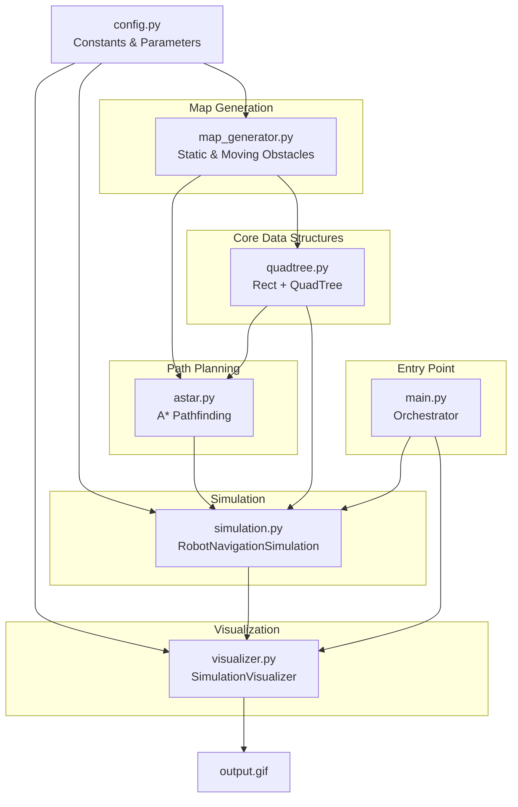
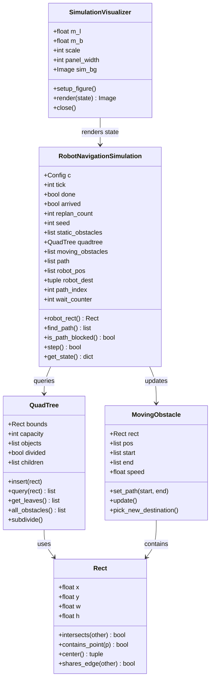
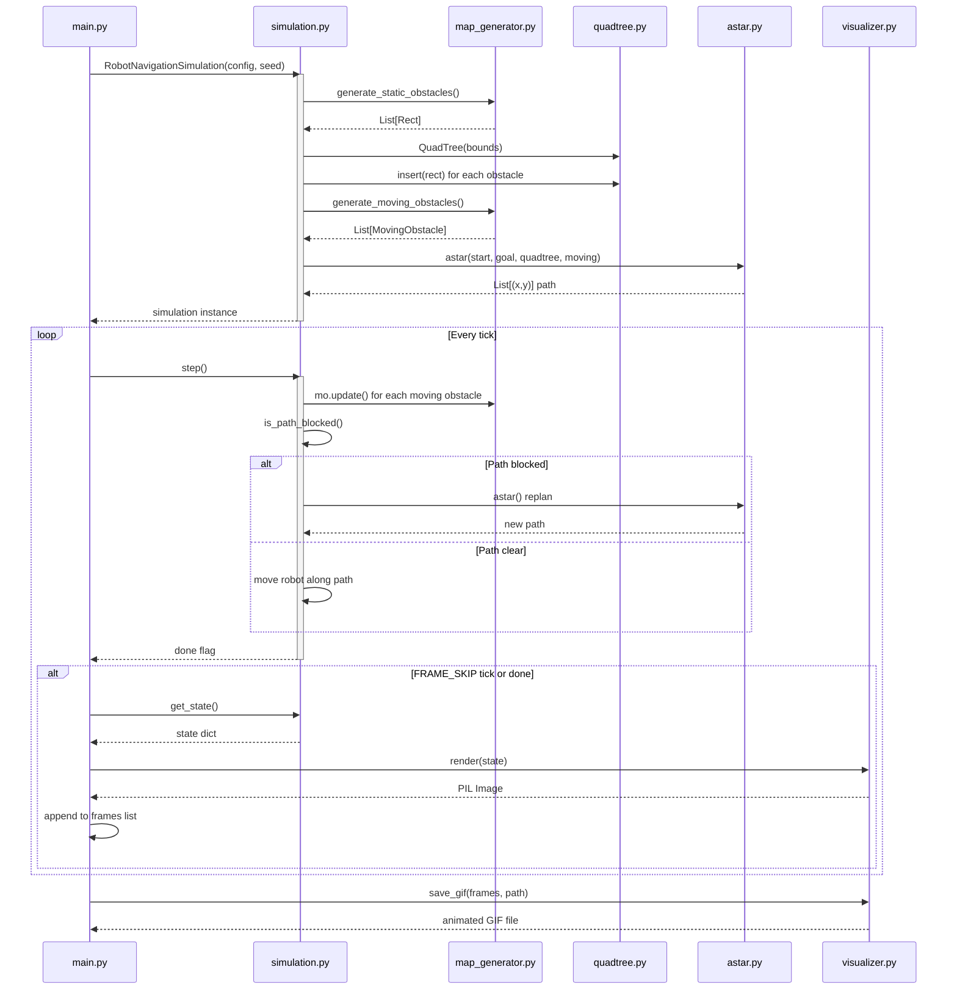
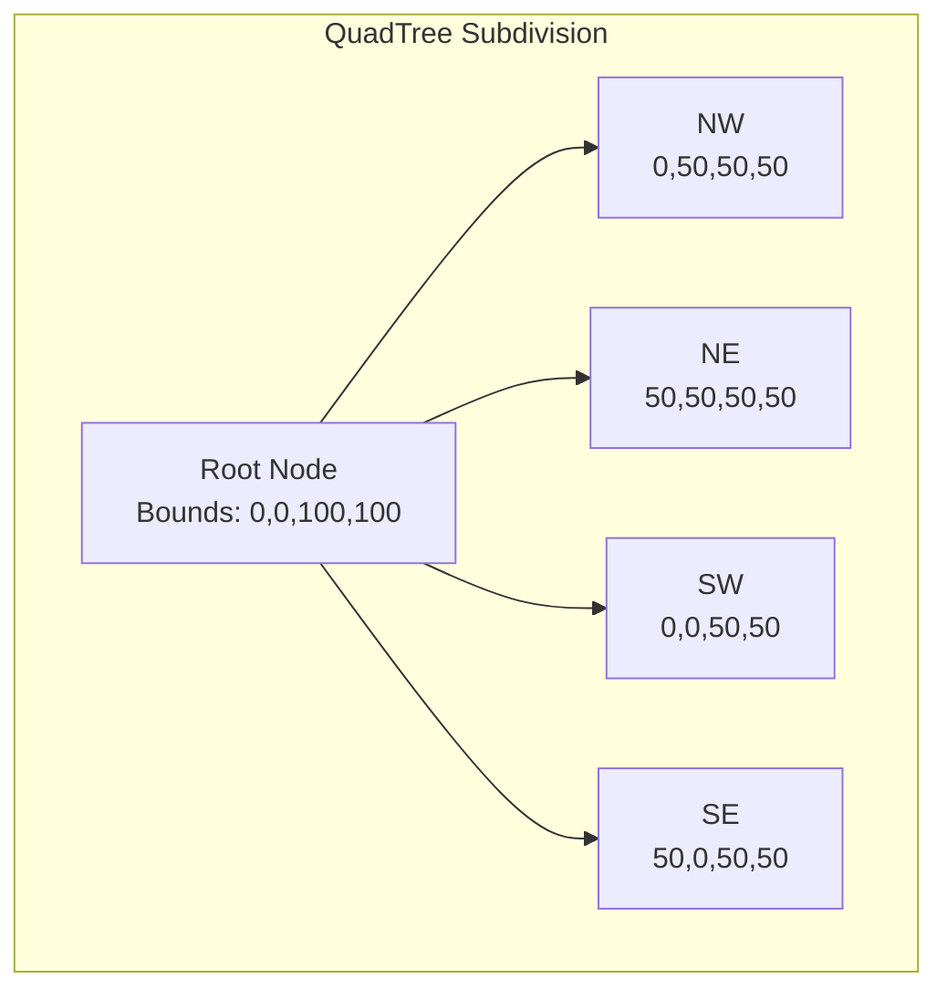
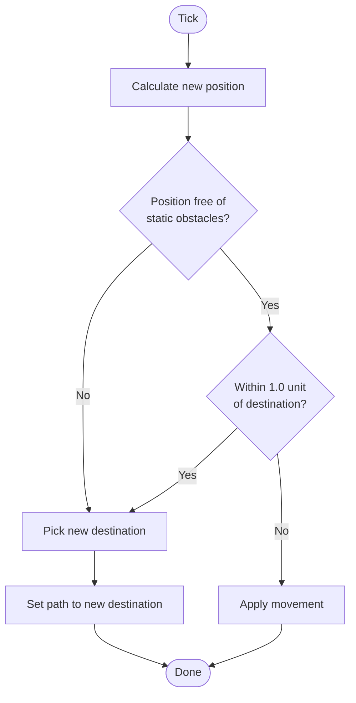
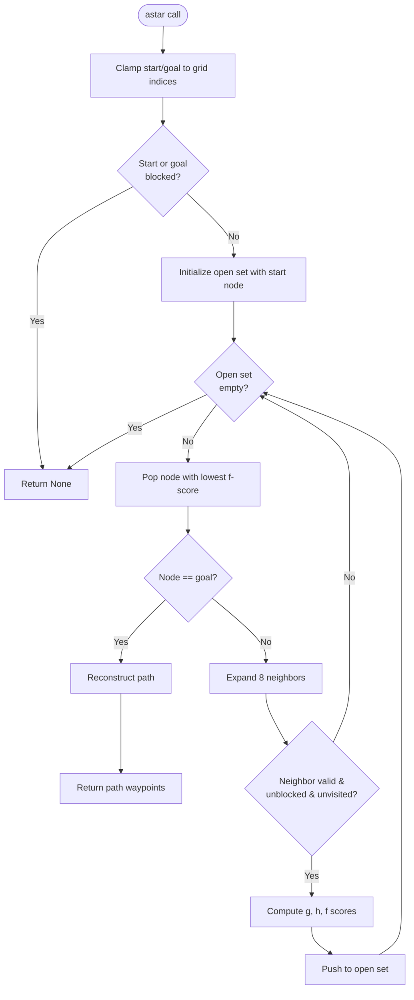
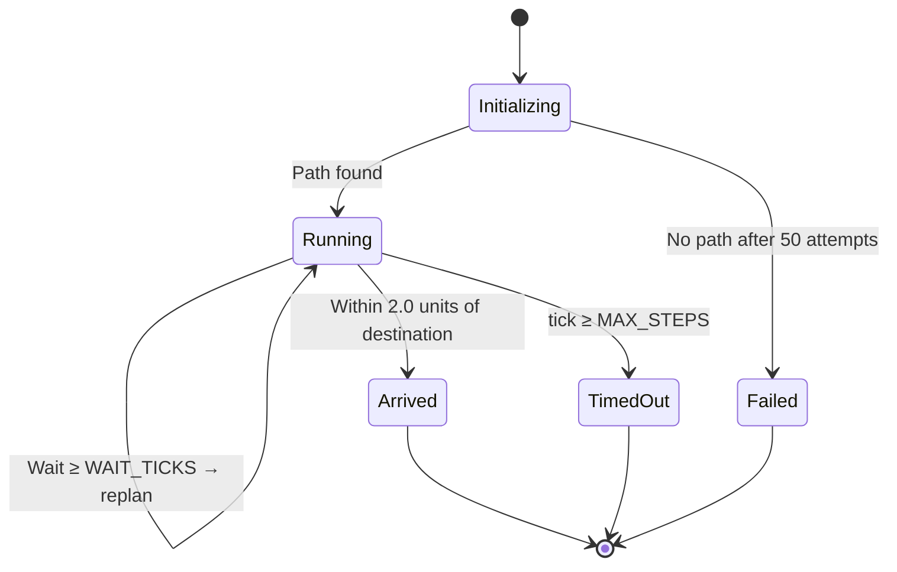

# Robotics Navigation Simulation

A 2D robot navigation simulation that demonstrates path planning, obstacle avoidance, and dynamic replanning using A* search and quadtree spatial indexing. The robot navigates from a start position to a destination while avoiding static and moving obstacles, with animated GIF output.

## Architecture Overview



## Project Structure

```
Robotics-Navigation/
|-- config.py              # Centralized configuration constants
|-- quadtree.py            # Rect and QuadTree spatial index
|-- map_generator.py       # Static & moving obstacle generation
|-- astar.py               # A* pathfinding algorithm
|-- simulation.py          # Core simulation engine
|-- visualizer.py          # Rendering and GIF output
|-- main.py                # Entry point / orchestrator
|-- test_runs/             # Generated GIF output directory
|-- DOCUMENTATION.md       # This file
```

---

## Component Model



---

## Data Flow



---

## Component Details

### `config.py` — Configuration

All simulation parameters are defined as module-level constants:

| Constant | Value | Description |
|---|---|---|
| `M_L`, `M_B` | 100, 100 | Map dimensions (world units) |
| `RL`, `RB` | 5, 3 | Robot dimensions (length x breadth) |
| `RS_X`, `RS_Y` | 5, 5 | Robot start position |
| `RD_X`, `RD_Y` | 95, 95 | Robot destination position |
| `OBSTACLE_COVERAGE` | 0.3 | Fraction of map area for static obstacles |
| `OL`, `OB` | 3, 2 | Moving obstacle dimensions |
| `NUM_MOVING` | 5 | Number of moving obstacles |
| `MOVING_SPEED` | 0.5 | Moving obstacle speed per tick |
| `SAFETY_MARGIN` | max(RL, RB) = 5 | Path blockage detection distance |
| `MAX_STEPS` | 800 | Maximum ticks before timeout |
| `WAIT_TICKS` | 5 | Consecutive blocked ticks before replan |
| `ROBOT_SPEED` | 2.0 | Robot speed per tick |
| `INFLATION` | 0.5 | Clearance radius around obstacles |
| `TIME_PER_TICK` | 0.05 | Simulated seconds per tick |
| `PANEL_WIDTH` | 200 | Info panel width in pixels |
| `FRAME_SKIP` | 2 | Render every Nth frame |
| `OUTPUT_DIR` | "test_runs" | GIF output directory |

---

### `quadtree.py` — Spatial Indexing

**`Rect`** — A 2D axis-aligned bounding rectangle:

- `intersects(other)` — AABB overlap test using the separating-axis theorem
- `contains_point(p)` — Point-in-rectangle test
- `center()` — Returns `(cx, cy)`
- `shares_edge(other)` — Edge adjacency within epsilon 0.01

**`QuadTree`** — Point-region quadtree for spatial partitioning:

- Subdivides into 4 equal children (NW, NE, SW, SE) when capacity (default 4) is exceeded
- Objects stored at leaf nodes; objects spanning boundaries are inserted into all intersecting children
- `query(rect)` returns all objects intersecting the query region in O(log n) average time
- `MIN_LEAF_SIZE = 1.0` prevents infinite subdivision



---

### `map_generator.py` — Obstacle Generation

**Static Obstacles** (`generate_static_obstacles`):

1. Creates exclusion zones (radius = 2 * max(rl, rb) + inflation) around start and destination
2. Uses rejection sampling (up to 2000 attempts) to place random rectangles (size 4–12 units)
3. Checks overlap with exclusion zones and existing obstacles via inflated bounding boxes
4. Stops when target area coverage (`OBSTACLE_COVERAGE`) is reached

**Moving Obstacles** (`MovingObstacle` class):

- Travels back and forth between two random waypoints
- `update()` moves by per-tick displacement; if new position collides with static obstacles, picks a new destination
- Picks a new destination when within 1.0 unit of current endpoint
- `find_free_position()` searches for a valid random position not intersecting any static obstacle

Algorithm for moving obstacle behavior:



---

### `astar.py` — A* Pathfinding

Standard A* search over a discretized grid:

- **Cell size**: Fixed at 2.0 world units
- **Grid**: `ceil(M_L / 2.0)` × `ceil(M_B / 2.0)` cells
- **Heuristic**: Euclidean distance (admissible)
- **Movement**: 8-directional (cardinal + diagonal), diagonal cost = `cell_size * sqrt(2)`
- **Obstacle check**: Query quadtree + moving obstacles with inflated cell rectangle
- **Early exit**: Returns `None` if start or goal cell is blocked



---

### `simulation.py` — Simulation Engine

`RobotNavigationSimulation` is the core state machine:

**Initialization**:
1. Seeds random number generator
2. Generates static obstacles → builds quadtree → generates moving obstacles → runs A*
3. Retries up to 50 times if no path exists; raises `RuntimeError` on failure

**`step()`** — Advances one simulation tick:

1. Increments tick counter
2. Updates all moving obstacles
3. Checks if path is blocked by any moving obstacle within `SAFETY_MARGIN + INFLATION`
4. If blocked for `WAIT_TICKS` consecutive ticks: replan via A* from current position
5. Otherwise: move robot toward next path waypoint at `ROBOT_SPEED`
6. Checks arrival (within 2.0 units of destination) or timeout (≥ `MAX_STEPS`)

**`is_path_blocked()`** — Uses point-to-segment distance (`_point_seg_dist`) from each moving obstacle center to each remaining path segment.



---

### `visualizer.py` — Rendering

`SimulationVisualizer` produces PIL images using Pillow:

- **Scale**: 5 pixels per world unit
- **Coordinate transform**: y-axis inverted (world y-up → pixel y-down)
- **Grid**: Light gray lines every 5 pixels
- **Rendered elements**: static obstacles (gray), moving obstacles (blue), robot (red), path (green polyline), destination (red X)

**Info panel** (200px wide sidebar):

- Time elapsed, step count, replan count, seed
- Status: `ARRIVED` (green), `TIMEOUT` (red), `IN PROGRESS` (yellow)

**Output**: Frames are collected every `FRAME_SKIP` ticks and assembled into an animated GIF via `imageio.mimsave()` with infinite looping.

---

### `main.py` — Orchestrator

Entry point that orchestrates the full pipeline:

1. Generates a random seed (0–999999)
2. Creates `RobotNavigationSimulation` — retries up to 50 attempts for a pathable map
3. Creates `SimulationVisualizer` with background grid
4. Runs simulation loop, capturing frames every `FRAME_SKIP` ticks
5. Saves frames as an animated GIF to `test_runs/RS-{serial}-{timestamp}.gif`
6. Prints summary statistics (ticks, status, replans, seed, frames, output path)

Output filename format: `RS-{serial}-{YYYYMMDD}_{HHMMSS}.gif`

---

## Algorithms Summary

| Algorithm | Location | Description |
|---|---|---|
| **A\* Search** | `astar.py` | Grid-based pathfinding with Euclidean heuristic and 8-directional movement |
| **Quadtree Spatial Index** | `quadtree.py` | Point-region quadtree for O(log n) obstacle intersection queries |
| **Rejection Sampling** | `map_generator.py` | Random obstacle placement with overlap avoidance |
| **Dynamic Replanning** | `simulation.py` | Re-triggers A* when moving obstacles block the current path |
| **Point-to-Segment Distance** | `simulation.py:162` | Vector projection for proximity detection |
| **Inflation** | `map_generator.py:6` | Obstacle expansion for safety clearance |

---

## Design Patterns

| Pattern | Location | Usage |
|---|---|---|
| **Spatial Partitioning** | `quadtree.py` | Quadtree for efficient collision detection |
| **State Machine** | `simulation.py` | Simulation states: running, arrived, timed out |
| **Model-View Separation** | `simulation.py`, `visualizer.py` | Simulation logic independent of rendering |
| **Factory** | `map_generator.py` | Obstacle generation functions |
| **Rejection Sampling** | `map_generator.py` | Random placement with collision rejection |
| **Strategy** | `astar.py` | Configurable inflation parameter for safety margins |

## Dependencies

| Library | Usage |
|---|---|
| **Pillow (PIL)** | Image creation, drawing, and compositing |
| **imageio** | GIF animation assembly |
| **numpy** | Indirect dependency (pulled by imageio) |

Standard library: `math`, `heapq`, `random`, `os`, `glob`, `re`, `sys`, `datetime`

## Running the Simulation

```bash
python main.py
```

Output GIFs are saved to `test_runs/`. Each run uses a random seed (printed to stdout for reproducibility).
